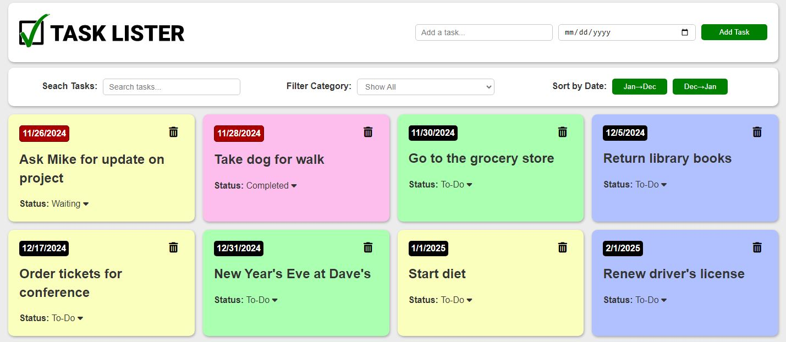
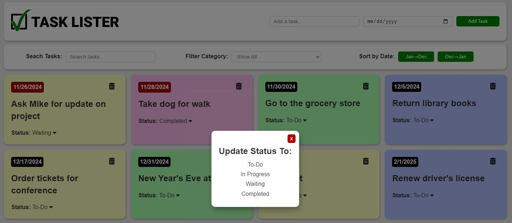
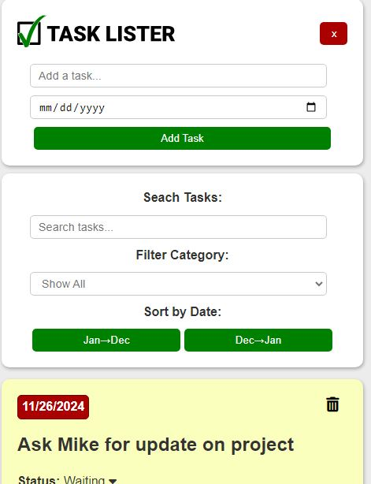
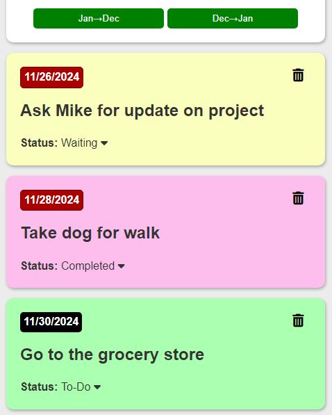

# Task Lister - A Simple Task Tracking App

---

Task Lister is a simple task tracking app that let's you add tasks you that you are looking to keep track of.

You are able to change the status of tasks to "to-do", "in progress", "waiting", and "completed". Once you finish a task and mark it completed, you can delete it when you no longer need to see it.

You, also, have the availability to filter, sort, or search by any of the available columns.

The tasks are saved to local storage, so as long as your local storage is preserved, your tasks will be preserved as well.

---

## Features

- Add tasks and due dates to the task board.
- Due date background turns red when due date is in the past.
- Sort by due date in both ascending and descending order.
- Search for a task by name and by date.
- Change the status of a task from to one of four different statuses.
  - To-Do
  - In Progess
  - Waiting
  - Completed
- Filter tasks by status to only show tasks in one of the four different statuses.
- Delete a task when no longer needed on list.
- Tasks are preserved to local storage and loaded on DOM loading.

---

## Tech Used

- HTML
- CSS (no framework or preprocessor)
- Vanilla Javascript using ES6 classes and modules
- Vite

---

## Demo

Link below to working Demo  
[Task Lister](https://grantgreene.github.io/task-lister-local-storage/)

---

## Additional Images

